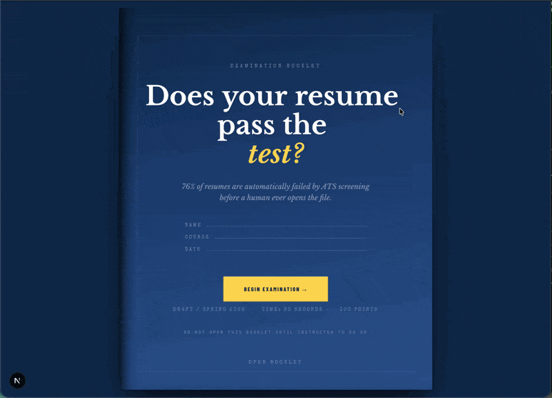

# DR4FT | AI Resume Optimizer

**Live: [proj-dr4ft.vercel.app](https://proj-dr4ft.vercel.app/)**

Your resume, graded. DR4FT runs resumes through ATS simulation and xAI Grok, returns per-section scores, missing keywords, and line-by-line rewrites. The whole product is dressed as a Blue Book exam booklet — cream ruled paper, red pen margin notes, PASS/FAIL grade stamps.




## Quick Start

```bash
pip install -r requirements.txt
```

Create `.env` in the project root:

```env
XAI_API_KEY=your_xai_api_key
XAI_MODEL=grok-4-fast-non-reasoning
```

```bash
cd backend && uvicorn main:app --reload --port 3200
```

```bash
cd frontend && npm install && npm run dev
```

Open `http://localhost:2200`.

## What It Does

**Analyzer** — Upload a PDF or DOCX. Two modes: Standard (NLP scoring across ATS compatibility, keyword match, format, and section coverage) or AI (xAI Grok returns overall quality, strengths, weaknesses, ATS score, and skill gaps).

**Builder** — Guided form with five templates (Modern, Classic, Minimal, Technical, Executive). Generates a clean, ATS-parseable PDF.

**Jobs** — Multi-portal aggregation across LinkedIn, Indeed, Naukri, Foundit, FreshersWorld, TimesJobs, Instahyre. Auto-detects location. Returns direct search links plus market insights on trending skills, top locations, and salary ranges.

**Landing** — Scroll-driven Blue Book that physically flips open. Cover is deep blue with a stitched border; pages inside are cream ruled paper with red margin annotations.

## Tech Stack

| Layer | Tools |
|---|---|
| Frontend | Next.js 16, React 19, TypeScript, Tailwind CSS 4 |
| Motion | Lenis smooth scroll + GSAP ScrollTrigger |
| Backend | Python, FastAPI, Pydantic |
| AI / NLP | xAI Grok (grok-4-fast-non-reasoning), NLTK, scikit-learn, spaCy |
| Parsing | pdfplumber, pypdf, python-docx, reportlab |
| Database | SQLite |
| Typography | Libre Baskerville, Special Elite, IBM Plex Mono, Barlow Condensed, Caveat |

## Project Structure

```
frontend/                      Next.js app
  src/app/
    page.tsx                   Blue cover + scroll-driven booklet
    analyzer/                  Submit your paper for grading
    builder/                   Draft your resume
    jobs/                      Multi-portal job search
    about/                     Course syllabus
  src/components/booklet/      ExamCard, ExamButton, GradeDisplay, PaperUpload
  src/lib/api.ts               Typed API client

backend/                       FastAPI
  main.py                      App + CORS + router registration
  routers/                     analyze, jobs, feedback, dashboard, auth
  services/                    analyzer.py, ai_analyzer.py, resume_builder.py
  models/schemas.py            Pydantic models
  config/                      SQLite init + 50+ role definitions

assets/                        Landing page GIFs
DESIGN.md                      Blue Book design system spec
```

## API

All endpoints prefixed with `/api`. Backend on `:3200`, frontend on `:2200`.

| Method | Endpoint | Description |
|---|---|---|
| POST | `/api/analyze` | Standard NLP analysis |
| POST | `/api/analyze/ai` | xAI Grok analysis |
| GET | `/api/roles` | Job categories + roles |
| POST | `/api/jobs/search` | Multi-portal job search |
| GET | `/api/jobs/insights` | Market trends + salary data |
| GET | `/api/dashboard/metrics` | Submission analytics |

---

Built by Thomas Ou
